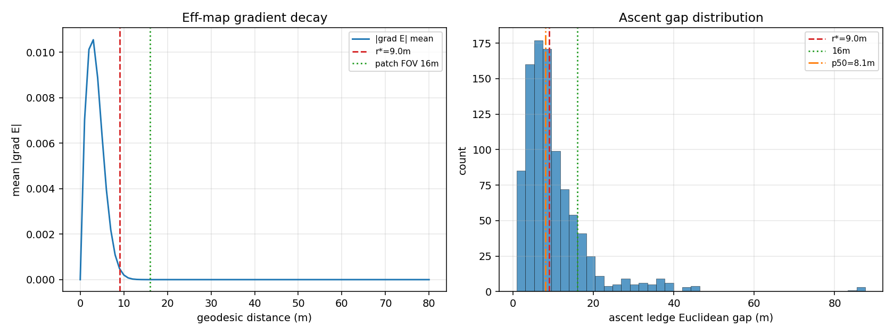
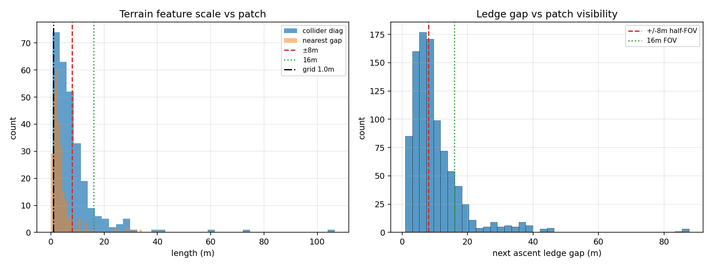
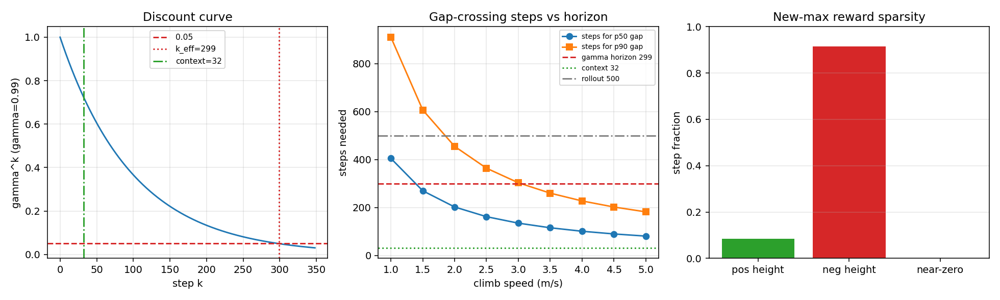
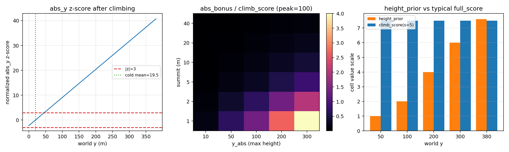
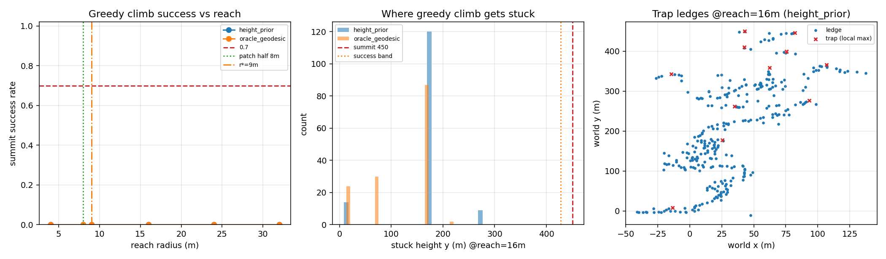

# 训练配置有效性离线数值分析报告

## 假设与输入

- 环境: `checkpoints/environment.json`
- 地图范围: x∈[-51.5,145.5], y∈[-10.4,450.4]
- **假设** `fixedDeltaTime dt = 0.0200 s`，`stepFrames = 1`
- **假设** 攀爬速度区间 `[1.0, 5.0] m/s`（用于跨间距步数换算）
- 关键配置: context_len=32, steps_per_rollout=500, gamma=0.99, gae_lambda=0.95
- 空间: patch=32@0.5m, grid=1.0m, diffusion_iters=50, alpha=0.2
- 奖励权重: efficiency_weight=1.0, speed_ref_steps=50, waypoint_weight=0.5, abs_height_weight=0.02, height_prior_weight=0.02, reward_alpha=0.5, neg_reward_scale=0.1

## 总览

| 维度 | 结论 |
|------|------|
| A. 效率图扩散半径 vs 上升点间距 | **部分够用** |
| B. patch 视野 / 分辨率 vs 地形尺度 | **部分够用** |
| C. 奖励视野 / 创新高稀疏度 / 台面间稠密引导 | **够用** |
| D. 观测归一化与奖励通道量纲平衡 | **部分够用** |
| E. 势场引导的贪心攀爬可达性 | **不足** |

## A. 效率图扩散半径 vs 上升点间距

**结论: 部分够用**

### 数值证据

- 扩散参数: iterations=50, alpha=0.2, 4-邻域
- 有效引导半径 r* ≈ 9.0 m（梯度降至邻域 10%）
- 上升点欧氏间距: n=955, p50=8.1 m, p90=18.2 m
- 间距 ≤ r* 的比例: 56.3%
- 间距 ≤ patch 视野(16m) 的比例: 85.7%
- 合成轨迹价值回传可达距离 ≈ 120.0 m

### 参数建议

- r*=9.0m 已略超 p50=8.1m，但仍有 44% 上升对超出引导半径；可小幅增大 diffusion_iterations / alpha 以覆盖更多尾部
- p90 间距 18.2 m 远大于 r*；远距阶段上升点仅靠效率图难以连成梯度，需配合 random_deploy / 更强 height_prior 或分层课程

### 指标摘要

```
r_star_m: 9
gap_p50_m: 8.095
gap_p90_m: 18.2
frac_within_rstar: 0.5634
frac_within_16m: 0.8565
backprop_reach_m: 120
n_ascent_pairs: 955
n_ledge_segments: 321
```

### 图



## B. patch 视野 / 分辨率 vs 地形尺度

**结论: 部分够用**

### 数值证据

- patch 视野: 32×32 @ 0.5m → 覆盖 16m（±8m）
- 地形/效率通道有效分辨率 ≈ 1.0m（crop_centered 上采样），部件 blob σ≈0.6m / 0.5m
- 碰撞体包围盒对角: p50=5.93m, p90=16.21m; 边长 p50=0.69m
- 碰撞体最近邻间距 p50=2.53m
- 下一上升台面落在 ±8m（半视野）内: 48.5%
- 下一上升台面落在 16m（全视野）内: 85.7%

### 参数建议

- 多数下一台面超出 ±8m patch；远距导航完全依赖效率图 ch1。可增大 patch_size 或 patch_resolution，或强化效率图扩散（见分析 A）

### 指标摘要

```
patch_extent_m: 16
half_fov_m: 8
diag_p50_m: 5.933
diag_p90_m: 16.21
nn_gap_p50_m: 2.527
frac_next_in_half_fov: 0.4848
frac_next_in_full_fov: 0.8565
```

### 图



## C. 奖励视野 / 创新高稀疏度 / 台面间稠密引导

**结论: 够用**

### 数值证据

- 假设 dt=0.0200s（stepFrames=1）；context=32步≈0.64s；rollout=500步≈10.0s
- gamma=0.99 → 折扣至 0.05 约 299 步 ≈ 5.98s
- 典型间距 p50=8.1m / p90=18.2m；速度 [1.0,5.0] m/s 时跨 p50 需 81–405 步
- 中速 3.0 m/s 跨 p50 ≈ 135 步 （相对有效视野 299 步: 内）
- 效率图覆盖典型间距: 56.3%（r*=9.0m）→ 台面间稠密引导 有
- 合成 stair 轨迹: 正高度奖励占比=8.5%, 望远镜和=20.133 vs summit=20.133 (一致)
- 非创新高步仅靠 neg_reward_scale=0.1 回落惩罚 + eff_delta

### 参数建议

- 跨台面步数 (135) > context_len (32)；策略无法在同一窗口内看到完整动作序列，依赖效率图记忆/状态压缩
- 创新高正奖励仅占 8.5%，信号极稀疏；确认 eff_delta 在扩散覆盖区内能提供稠密替代

### 指标摘要

```
k_eff_steps: 299
t_eff_s: 5.98
context_steps: 32
gap_p50_m: 8.095
steps_p50_at_mid_speed: 134.9
frac_gaps_within_rstar: 0.5634
pos_reward_frac: 0.085
telescope_ok: True
```

### 图



## D. 观测归一化与奖励通道量纲平衡

**结论: 部分够用**

### 数值证据

- dynamics 维=34: vel=15, ang_sc=6, rel=12, abs_y=1
- 冷启动标定 abs_y: mean=19.48, std=8.85 → y=200 时 z=20.4, y=380 时 z=40.7
- 角度 sin/cos 维 std 范围 [0.699, 0.714]
- 早期场景 summit=2/peak=100: climb_score=3.00, abs_height_bonus=1.00, 比值 bonus/climb=0.33
- abs_height_weight=0.02; 网格中位 bonus/climb=0.13
- height_prior @y=50/200/380 = 1.00/4.00/7.60；典型 climb_score(summit=5)=7.50

### 参数建议

- 冷启动低处标定后 abs_y 在高海拔严重 OOD；可改为 (y - water_threshold) 再归一化、或按对数/分段标定、或扩大冷启动 deploy 高度覆盖

### 指标摘要

```
cold_mean_y: 19.48
cold_std_y: 8.851
z_at_y200: 20.39
z_at_ymax: 40.73
early_bonus_over_climb: 0.3333
median_bonus_over_climb: 0.1333
height_prior_at_200: 4
typical_climb_score: 7.5
```

### 图



## E. 势场引导的贪心攀爬可达性

**结论: 不足**

### 数值证据

- 台面可达图: 321 段, 顶 y=450, 底 y=-12; 随机低处起点 143 个 (y≤173)
- 到顶判据: 终点 y ≥ 427（顶部 5% 带，对高山偏严，仅作参考）
- **爬升高度占比中位（reach=16m）: height_prior=14.7%, oracle=6.0%**（1.0=从起点爬到顶）
- 内建 height_prior @reach=16m 到顶率: 0.0%；扫描内到顶率未达 90%
- oracle(到顶测地距离场) @reach=16m 到顶率: 0.0%；扫描内到顶率未达 90%
- height_prior @reach=16m 卡住高度中位: 178 (顶 450)
- ⚠️ 方法学局限: 台面图只建模「可着陆平台」间的跳跃可达性，不表示 GOI 中靠锤子摩擦攀爬垂直墙面，故对可达性偏保守（低估）；结论应理解为「靠平台跳跃的贪心策略」的下界，而非物理上限

### 参数建议

- 即便最优势场，reach=16m 也只爬到 6% → 存在**几何断裂**的孤立台面；即便扫描上限 reach=32m 仍无法稳定到顶（存在极远断裂），远超 patch 半视野(8m)/r*(9m)，提示远距阶段应靠 random_deploy 分段投放而非单条长轨迹

### 指标摘要

```
n_starts: 143
y_summit: 450.3
success_band_y: 427.2
hp_climb_frac_reach16: 0.1472
oracle_climb_frac_reach16: 0.05991
hp_success_at_reach16: 0
oracle_success_at_reach16: 0
hp_reach_for_90pct: -1
oracle_reach_for_90pct: -1
n_trap_ledges_reach16: 12
```

### 图



## 综合建议（按优先级）

1. [不足] 即便最优势场，reach=16m 也只爬到 6% → 存在**几何断裂**的孤立台面；即便扫描上限 reach=32m 仍无法稳定到顶（存在极远断裂），远超 patch 半视野(8m)/r*(9m)，提示远距阶段应靠 random_deploy 分段投放而非单条长轨迹
2. [部分够用] r*=9.0m 已略超 p50=8.1m，但仍有 44% 上升对超出引导半径；可小幅增大 diffusion_iterations / alpha 以覆盖更多尾部
3. [部分够用] p90 间距 18.2 m 远大于 r*；远距阶段上升点仅靠效率图难以连成梯度，需配合 random_deploy / 更强 height_prior 或分层课程
4. [部分够用] 多数下一台面超出 ±8m patch；远距导航完全依赖效率图 ch1。可增大 patch_size 或 patch_resolution，或强化效率图扩散（见分析 A）
5. [部分够用] 冷启动低处标定后 abs_y 在高海拔严重 OOD；可改为 (y - water_threshold) 再归一化、或按对数/分段标定、或扩大冷启动 deploy 高度覆盖
6. [够用] 跨台面步数 (135) > context_len (32)；策略无法在同一窗口内看到完整动作序列，依赖效率图记忆/状态压缩
7. [够用] 创新高正奖励仅占 8.5%，信号极稀疏；确认 eff_delta 在扩散覆盖区内能提供稠密替代

---
*本报告由 `python -m src.tests.analysis.analyze_effectiveness` 生成，不修改训练代码。*
